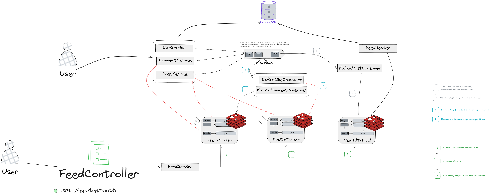

# Post Service

# Использованные технологии

* [Spring Boot](https://spring.io/projects/spring-boot) – как основной фреймворк
* [PostgreSQL](https://www.postgresql.org/) – как основная реляционная база данных
* [Redis](https://redis.io/) – как кэш и очередь сообщений через pub/sub
* [Kafka](https://kafka.apache.org/) - как брокер сообщений
* [Avro](https://avro.apache.org/) - для сериализации и десериализации ивентов для Kafka
* [testcontainers](https://testcontainers.com/) – для изолированного тестирования с базой данных
* [Liquibase](https://www.liquibase.org/) – для ведения миграций схемы БД
* [Gradle](https://gradle.org/) – как система сборки приложения

# База данных

* База поднимается в отдельном сервисе [infra](../infra)
* Redis, Kafka и Avro также поднимаются в [infra](../infra)
* Liquibase сам накатывает нужные миграции на PostgreSQL при старте приложения
* В тестах используется [testcontainers](https://testcontainers.com/), в котором тоже запускается отдельный инстанс
  postgres
* В коде продемонстрирована работа с JPA (Hibernate)

# Как начать работу с микросервисом?

1. Сначала нужно склонировать родительский репозиторий
```shell
git clone https://github.com/Linempy/startup-platform.git
```

2. Перейти в нужный микросервис

# Как запустить локально?

Сначала нужно развернуть базу данных из директории [infra](../infra)

Далее собрать gradle проект

```shell
# Нужно запустить из корневой директории, где лежит build.gradle.kts
gradle build
```

Запустить JAR-файл

```shell
java -jar build/libs/ServiceTemplate-1.0.jar
```

Но рекомендуется все это делать сделать через IDE

# Код
Реализована логика системы постов, лайков, комментариев

## Лента новостей
В этом микросервисе также реализована лента новостей. Ниже представлена архитектура фичи:



# Тесты
Используемые инструменты тестирования:
* SpringBootTest
* MockMvc
* Testcontainers
* AssertJ
* JUnit5
* Parameterized tests

